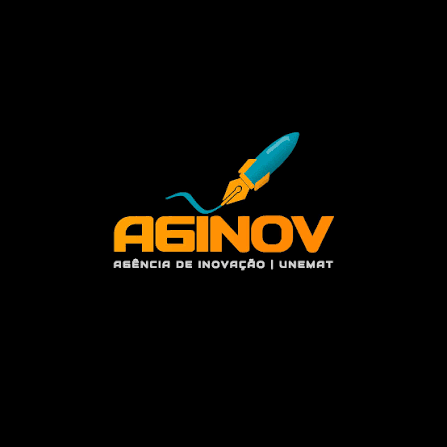
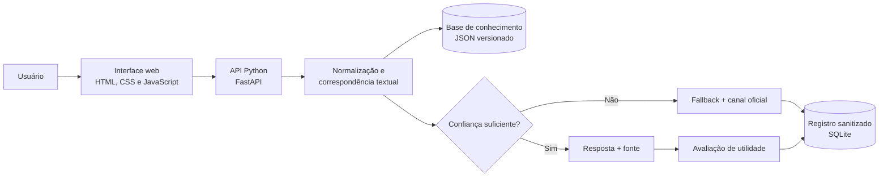

<p align="center">
  
</p>

# Chatbot AGINOV

Protótipo web de chatbot para apoio ao atendimento informacional da Agência de Inovação da Universidade do Estado de Mato Grosso (AGINOV/UNEMAT).

O projeto integra o subprojeto de iniciação científica **“Chatbot AGINOV: Desenvolvimento Web e Inteligência Artificial”**, vinculado ao projeto **Tecnologias Digitais em Setores Estratégicos (TecDISE)**. Seu propósito é facilitar o acesso inicial a informações institucionais sem substituir os canais, documentos ou decisões oficiais da Universidade.

> **Status:** planejamento e levantamento inicial. O software ainda não foi implementado.

## Problema

Informações sobre inovação, tecnologia, propriedade intelectual, empreendedorismo e serviços da AGINOV podem estar distribuídas entre páginas, documentos e canais diferentes. Isso dificulta a localização de orientações iniciais e pode gerar atendimentos manuais repetitivos.

O Chatbot AGINOV será um artefato experimental para organizar esse conhecimento e oferecer uma interface conversacional acessível. Quando não houver uma resposta confiável, o sistema deverá deixar essa limitação explícita e encaminhar o usuário para um canal oficial.

## Objetivo

Desenvolver e avaliar um protótipo web capaz de:

- receber perguntas em linguagem natural;
- sugerir assuntos e categorias de atendimento;
- localizar respostas em uma base de conhecimento aprovada;
- informar o grau de limitação da resposta e aplicar fallback quando necessário;
- direcionar o usuário aos canais oficiais;
- registrar, de forma minimizada e segura, dúvidas que a base não conseguiu atender;
- gerar evidências sobre qualidade das respostas, usabilidade e viabilidade técnica.

## Escopo do MVP

### Incluído

- interface conversacional web responsiva;
- saudação, orientações de uso e aviso de caráter informacional;
- categorias e perguntas frequentes;
- base de conhecimento com pergunta, variações, resposta, categoria, palavras-chave, fonte e data de revisão;
- mecanismo simples de correspondência textual, sem geração autônoma de conteúdo;
- critério configurável de confiança;
- resposta de fallback e encaminhamento oficial;
- registro sanitizado de perguntas não atendidas;
- avaliação simples da utilidade da resposta;
- testes funcionais, de conteúdo, acessibilidade e usabilidade;
- documentação técnica, tutorial de uso e relatório de avaliação.

### Fora do escopo inicial

- substituir o atendimento ou representar posicionamento oficial da AGINOV/UNEMAT;
- IA generativa, RAG ou contratação de APIs pagas;
- integração com WhatsApp ou outros mensageiros;
- autenticação de usuários e coleta de dados pessoais;
- painel administrativo completo;
- implantação institucional em produção;
- respostas sobre casos individuais, decisões administrativas ou dados sigilosos.

Esses itens poderão ser estudados depois do MVP, condicionados aos resultados, às autorizações institucionais e à análise de privacidade e segurança.

## Funcionamento esperado

1. O usuário acessa a página, lê o aviso e escolhe uma categoria ou escreve uma pergunta.
2. A API normaliza o texto e compara a pergunta com variações e palavras-chave da base aprovada.
3. Se o resultado cumprir o critério de confiança, o chatbot apresenta a resposta e sua fonte oficial.
4. Se não houver confiança suficiente, o chatbot não tenta completar a informação: exibe o fallback e indica um canal oficial.
5. A pergunta não atendida pode ser registrada após sanitização, sem identificação do usuário, para revisão posterior.
6. O usuário pode avaliar se a resposta foi útil.

## Arquitetura de referência



Essa é uma decisão inicial para reduzir complexidade. FastAPI, JSON e SQLite deverão ser confirmados durante o levantamento de requisitos. PostgreSQL, Supabase e modelos avançados não são necessários para demonstrar o MVP.

Os componentes, contratos da API, modelo de dados, fluxos, controles de segurança e decisões técnicas estão detalhados em [docs/ARQUITETURA.md](docs/ARQUITETURA.md).

## Tecnologias previstas

- **Frontend:** HTML5, CSS3 e JavaScript;
- **Backend:** Python com FastAPI;
- **Conhecimento:** JSON versionado, alimentado somente por conteúdo autorizado;
- **Registros locais:** SQLite;
- **PLN:** normalização, palavras-chave e similaridade textual;
- **Qualidade:** testes automatizados, testes de conteúdo e avaliação de usabilidade;
- **Versionamento:** Git e GitHub.

As bibliotecas concretas e suas versões serão registradas quando a implementação começar.

## Estrutura planejada

```text
chatbot-aginov/
├── app/                    # API e mecanismo de resposta
├── frontend/               # Interface web
├── data/
│   ├── knowledge_base/     # Conteúdo aprovado e versionado
│   └── samples/            # Exemplos fictícios para desenvolvimento
├── docs/                   # Planejamento e documentação do projeto
├── tests/                  # Testes automatizados e conjuntos de avaliação
├── README.md
└── ...                     # Configurações adicionadas durante a implementação
```

A estrutura representa o destino planejado, não o estado atual do repositório.

## Privacidade, segurança e LGPD

O MVP seguirá os princípios de finalidade, adequação, necessidade, segurança, prevenção e transparência. Em particular:

- não solicitará nome, CPF, RG, senha, dados bancários ou dados sensíveis;
- alertará o usuário para não inserir dados pessoais na conversa;
- não criará perfil de usuário nem dependerá de identificação individual;
- limitará registros ao necessário para avaliar e melhorar o protótipo;
- sanitizará perguntas não atendidas antes da persistência;
- definirá prazo de retenção e procedimento de exclusão antes de qualquer teste com usuários;
- usará somente conteúdo público ou expressamente autorizado na base;
- exibirá fonte e data de revisão das informações quando disponíveis;
- encaminhará casos específicos ou incertos aos canais oficiais.

Qualquer teste com pessoas e qualquer uso de registros reais dependerão das orientações do projeto, das autorizações aplicáveis e da avaliação ética e institucional pertinente.

## Critérios de sucesso

O protótipo será avaliado por evidências, incluindo:

- percentual de respostas consideradas adequadas no conjunto de teste;
- frequência de fallback e perguntas ainda não cobertas;
- tempo de resposta do mecanismo local;
- cobertura das categorias priorizadas;
- resultado dos testes funcionais e de acessibilidade;
- clareza, facilidade de uso e satisfação na avaliação de usabilidade;
- rastreabilidade de cada resposta até uma fonte revisada.

As fórmulas, metas iniciais e o protocolo de avaliação estão detalhados no [planejamento do projeto](docs/PLANEJAMENTO.md).

## Metodologia

O trabalho utilizará **Design Science Research**, percorrendo ciclos de identificação do problema, definição de objetivos, projeto, desenvolvimento, demonstração, avaliação e comunicação. A execução técnica será incremental, organizada em sprints quinzenais e revisada com o orientador.

## Planejamento

O roadmap completo contém:

- fases e sprints;
- backlog priorizado;
- entregáveis e critérios de aceite;
- definição de pronto;
- plano de testes e métricas;
- riscos e medidas de mitigação;
- responsabilidades e rastreabilidade dos objetivos.

Consulte [docs/PLANEJAMENTO.md](docs/PLANEJAMENTO.md).

## Documentação

- [Arquitetura do projeto](docs/ARQUITETURA.md)
- [Planejamento, roadmap e sprints](docs/PLANEJAMENTO.md)

## Execução local

Ainda não há uma versão executável. Os requisitos, comandos de instalação, variáveis de ambiente e instruções para testes serão incluídos aqui assim que a base técnica for criada nas sprints de implementação.

## Limitações conhecidas

O mecanismo planejado reconhece apenas assuntos representados na base de conhecimento e pode não compreender ambiguidades, erros de digitação ou formulações muito diferentes das cadastradas. O protótipo não interpreta documentos privados, não toma decisões e não garante resposta para toda pergunta. A precisão depende diretamente da qualidade, da cobertura e da atualização do conteúdo validado.

## Referências principais

O embasamento inclui trabalhos sobre chatbots, Design Science Research, engenharia de software, usabilidade, qualidade de software e inteligência artificial, com destaque para Adamopoulou e Moussiades (2020), Caldarini, Jaf e McGarry (2022), Hevner et al. (2004), Peffers et al. (2007), Nielsen (1993), Sommerville (2016), Russell e Norvig (2021), ISO/IEC 25010 e a Lei nº 13.709/2018 (LGPD).

A base de respostas deverá citar páginas, documentos e materiais oficiais da AGINOV/UNEMAT consultados durante o levantamento.

## Licença

A licença do código e as condições de uso do conteúdo institucional ainda serão definidas com o orientador e a instituição. Até essa definição, este repositório não concede licença de uso, distribuição ou implantação institucional.
