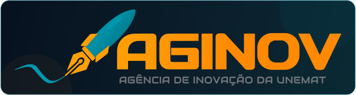
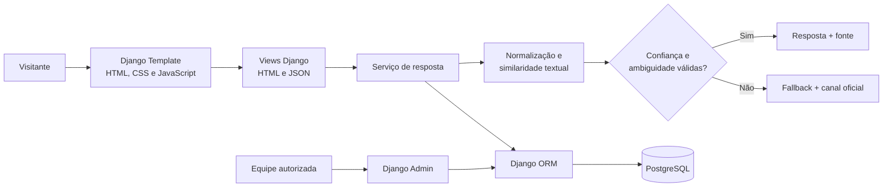
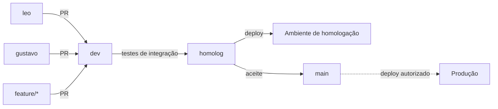

<div align="center">
  

  <h1>Chatbot AGINOV</h1>

  <p><strong>Assistente web para acesso simples, seguro e rastreável às informações da AGINOV/UNEMAT.</strong></p>

  <p>
    
    
    
  </p>

  <p>
    <a href="#sobre-o-projeto">Sobre</a> •
    <a href="#stack-tecnológica">Tecnologias</a> •
    <a href="#arquitetura">Arquitetura</a> •
    <a href="#planejamento">Planejamento</a> •
    <a href="#estratégia-de-branches">Branches</a> •
    <a href="#documentação">Documentação</a>
  </p>
</div>

---

## Sobre o projeto

O **Chatbot AGINOV** é um protótipo de pesquisa para apoiar o atendimento informacional da Agência de Inovação da Universidade do Estado de Mato Grosso. A aplicação organizará perguntas frequentes sobre inovação, tecnologia, propriedade intelectual e empreendedorismo em uma experiência conversacional acessível.

> O chatbot oferece orientação inicial. Ele não substitui documentos, decisões, servidores ou canais oficiais da AGINOV/UNEMAT.

| |                                                                         |
| --- |-------------------------------------------------------------------------|
| **Subprojeto** | Chatbot AGINOV: Desenvolvimento Web e Inteligência Artificial           |
| **Projeto vinculado** | Tecnologias Digitais em Setores Estratégicos — TecDISE                  |
| **Bolsista** | Léo Walker da Silva, Gustavo Henrique Dias Felix e Dean de Novais Souza |
| **Orientador** | Fernando Selleri Silva e Amabilen de Oliveira Furlan                    |
| **Instituição** | UNEMAT — Câmpus Cáceres Jane Vanini                                     |
| **Curso** | Ciência da Computação                                                   |
| **Fase atual** | Planejamento, fundamentação e levantamento inicial                      |

### Problema e proposta

| Problema | Resposta do projeto |
| --- | --- |
| Informações distribuídas em páginas, documentos e canais diferentes. | Base de conhecimento centralizada e revisada. |
| Usuários nem sempre sabem onde procurar uma orientação inicial. | Interface conversacional com categorias e perguntas livres. |
| Dúvidas repetidas aumentam o atendimento manual. | Respostas frequentes com fonte e encaminhamento oficial. |
| Uma resposta incerta pode causar desinformação. | Critério de confiança, detecção de ambiguidade e fallback seguro. |

## Stack tecnológica

<table align="center">
  <tr>
    <td align="center" width="150">
      <a href="https://www.python.org/">
        
      </a>
      <br><strong>Python</strong><br><sub>Linguagem principal</sub>
    </td>
    <td align="center" width="150">
      <a href="https://www.djangoproject.com/">
        
      </a>
      <br><strong>Django</strong><br><sub>Aplicação web e Admin</sub>
    </td>
    <td align="center" width="150">
      <a href="https://www.postgresql.org/">
        
      </a>
      <br><strong>PostgreSQL</strong><br><sub>Persistência relacional</sub>
    </td>
  </tr>
  <tr>
    <td align="center" width="150">
      <a href="https://developer.mozilla.org/docs/Web/HTML">
        
      </a>
      <br><strong>HTML5</strong><br><sub>Estrutura semântica</sub>
    </td>
    <td align="center" width="150">
      <a href="https://developer.mozilla.org/docs/Web/CSS">
        
      </a>
      <br><strong>CSS3</strong><br><sub>Interface responsiva</sub>
    </td>
    <td align="center" width="150">
      <a href="https://developer.mozilla.org/docs/Web/JavaScript">
        
      </a>
      <br><strong>JavaScript</strong><br><sub>Interação conversacional</sub>
    </td>
  </tr>
</table>

Django centralizará templates, endpoints JSON, validações, ORM, migrations, autenticação administrativa e gestão de conteúdo. O mecanismo de correspondência será implementado em Python puro para permanecer explicável e testável.

## Escopo do MVP

| Incluído no MVP | Preparado para uma etapa futura |
| --- | --- |
| ✅ Interface conversacional responsiva | ⏭️ IA generativa ou RAG |
| ✅ Categorias e perguntas em linguagem natural | ⏭️ Integração com WhatsApp |
| ✅ Base revisada com respostas, variações e fontes | ⏭️ Painel editorial personalizado |
| ✅ Correspondência textual determinística | ⏭️ Autenticação do público |
| ✅ Critério de confiança e fallback | ⏭️ Integrações com sistemas institucionais |
| ✅ Feedback de utilidade da resposta | ⏭️ Implantação institucional definitiva |
| ✅ Registro sanitizado de dúvidas não atendidas | ⏭️ Modelos externos pagos |
| ✅ Django Admin para manutenção interna básica | ⏭️ Escalabilidade de grande volume |

O MVP não responderá sobre casos individuais, decisões administrativas ou dados sigilosos e não representará posicionamento oficial da instituição.

## Como funciona

| Etapa | Ação | Proteção aplicada |
| :---: | --- | --- |
| 1 | O visitante escolhe uma categoria ou escreve uma pergunta. | Aviso para não inserir dados pessoais. |
| 2 | Uma view Django valida a requisição. | CSRF, formato e limite de tamanho. |
| 3 | O serviço normaliza o texto e consulta itens aprovados. | Somente conteúdo vigente participa da busca. |
| 4 | O matcher classifica os candidatos. | Pontuação e margem de ambiguidade configuráveis. |
| 5 | O sistema responde ou aplica fallback. | Nenhuma resposta afirmativa abaixo da confiança mínima. |
| 6 | O visitante pode avaliar a utilidade. | Persistência mínima, agregada e com retenção definida. |

## Arquitetura



A solução seguirá um **monólito modular**: uma única aplicação Django, separada internamente em módulos de chat, conhecimento e interações. Essa escolha reduz o custo operacional do protótipo sem misturar a interface com as regras do experimento.

Consulte a [arquitetura completa](docs/ARQUITETURA.md) para ver componentes, contratos HTTP, modelo relacional, segurança, testes e implantação.

<details>
<summary><strong>Ver estrutura planejada do repositório</strong></summary>

```text
chatbot-aginov/
├── backend/                # Aplicação Django e regras de negócio
│   ├── config/             # Settings, URLs e WSGI/ASGI
│   ├── apps/
│   │   ├── chat/           # Endpoints e mecanismo de resposta
│   │   ├── knowledge/      # Conhecimento e Django Admin
│   │   └── interactions/   # Feedback e dúvidas não atendidas
│   └── manage.py
├── frontend/               # Interface web servida pelo Django
│   ├── templates/          # Templates HTML
│   └── static/             # CSS, JavaScript e imagens da aplicação
├── data/                   # Dados, seeds e amostras para desenvolvimento
│   ├── seeds/
│   └── samples/
├── tests/                  # Testes do backend e do frontend
│   ├── backend/
│   └── frontend/
├── assets/                 # Imagens da documentação
├── docs/                   # Arquitetura e planejamento
└── README.md
```

</details>

## Privacidade e segurança

O projeto adota **privacidade desde a concepção**:

- não solicita nome, CPF, RG, senha, dados bancários ou dados sensíveis do visitante;
- não cria perfil público nem depende de identificação individual;
- não armazena o histórico completo da conversa;
- sanitiza perguntas não atendidas antes de qualquer persistência autorizada;
- utiliza contas administrativas apenas para a equipe responsável;
- relaciona respostas a fontes e datas de revisão;
- encaminha situações específicas ou incertas aos canais oficiais;
- exige protocolo de retenção e exclusão antes de testes com dados reais.

Qualquer teste com pessoas dependerá das autorizações e orientações éticas e institucionais aplicáveis.

## Qualidade e critérios de sucesso

| Dimensão | Evidência esperada |
| --- | --- |
| Respostas | adequação, cobertura segura e precisão do fallback |
| Conteúdo | 100% das respostas ativas com fonte e revisão válidas |
| Funcionalidade | todos os fluxos críticos aprovados |
| Desempenho | consulta local avaliada pelo percentil 95 |
| Usabilidade | clareza, conclusão de tarefas e satisfação |
| Acessibilidade | teclado, foco, semântica, contraste e leitores de tela |
| Privacidade | ausência de dados pessoais nos registros de interação |

As fórmulas, metas iniciais e o protocolo de avaliação estão no [planejamento do projeto](docs/PLANEJAMENTO.md).

## Planejamento

O desenvolvimento combina **Design Science Research** e sprints quinzenais:

| Fase | Sprints | Resultado |
| --- | :---: | --- |
| Preparação científica | 0–1 | governança, fundamentação e protocolo de avaliação |
| Descoberta e projeto | 2–3 | requisitos, conteúdo e experiência conversacional |
| Construção do MVP | 4–7 | Django, PostgreSQL, matcher e interface integrados |
| Avaliação e consolidação | 8–10 | testes, usabilidade, documentação e apresentação |

O backlog, os critérios de aceite, a Definition of Done, os riscos e as métricas estão detalhados em [docs/PLANEJAMENTO.md](docs/PLANEJAMENTO.md).

## Estratégia de branches

| Branch | Papel no fluxo | Recebe alterações de |
| --- | --- | --- |
| `leo` | desenvolvimento individual de Léo | trabalho de Léo |
| `gustavo` | desenvolvimento individual de Gustavo | trabalho de Gustavo |
| `dev` | integração contínua da equipe | `leo`, `gustavo` e `feature/*` |
| `homolog` | deploy e testes de aceite | `dev`, após testes de integração |
| `main` | versão estável e candidata a produção | `homolog`, após aprovação |



### Regras de colaboração

- o desenvolvimento cotidiano não acontece diretamente na `main`;
- branches individuais devem ser atualizadas com `dev` antes do Pull Request;
- toda integração em `dev` deve informar objetivo e critérios de teste;
- `dev` só avança para `homolog` com testes e documentação atualizados;
- `homolog` só avança para `main` depois do aceite e da correção de defeitos bloqueantes;
- produção parte da `main` e depende de autorização institucional;
- segredos, dados pessoais e configurações particulares da IDE não são versionados.

## Documentação

| Documento | Conteúdo |
| --- | --- |
| [Arquitetura](docs/ARQUITETURA.md) | componentes, dados, interfaces HTTP, segurança, implantação e ADRs |
| [Planejamento](docs/PLANEJAMENTO.md) | roadmap, sprints, backlog, testes, métricas, riscos e entregáveis |

## Execução local

> Ainda não há uma versão executável. O repositório está na fase de planejamento.

Dependências, variáveis de ambiente, migrations, carga inicial, comandos Django e execução de testes serão documentados aqui quando a fundação técnica for implementada.

## Limitações conhecidas

O matcher reconhecerá apenas assuntos representados na base de conhecimento. Formulações ambíguas, erros de digitação e perguntas muito diferentes das variações cadastradas podem resultar em fallback. O protótipo não interpreta documentos privados, não toma decisões e não garante cobertura para toda pergunta.

<details>
<summary><strong>Referências e créditos</strong></summary>

O embasamento inclui trabalhos sobre chatbots, Design Science Research, engenharia de software, usabilidade, qualidade de software e inteligência artificial, com destaque para Adamopoulou e Moussiades (2020), Caldarini, Jaf e McGarry (2022), Hevner et al. (2004), Peffers et al. (2007), Nielsen (1993), Sommerville (2016), Russell e Norvig (2021), ISO/IEC 25010 e a Lei nº 13.709/2018 (LGPD).

Referências tecnológicas: [Django](https://docs.djangoproject.com/) e [PostgreSQL](https://www.postgresql.org/docs/). Os ícones da stack são fornecidos pelo projeto [Devicon](https://github.com/devicons/devicon).

A base de respostas citará páginas, documentos e materiais oficiais da AGINOV/UNEMAT usados no levantamento.

</details>

## Licença

A licença do código e as condições de uso do conteúdo institucional ainda serão definidas com o orientador e a instituição. Até essa definição, este repositório não concede licença de uso, distribuição ou implantação institucional.
