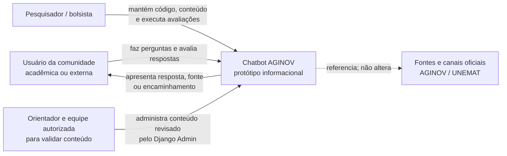
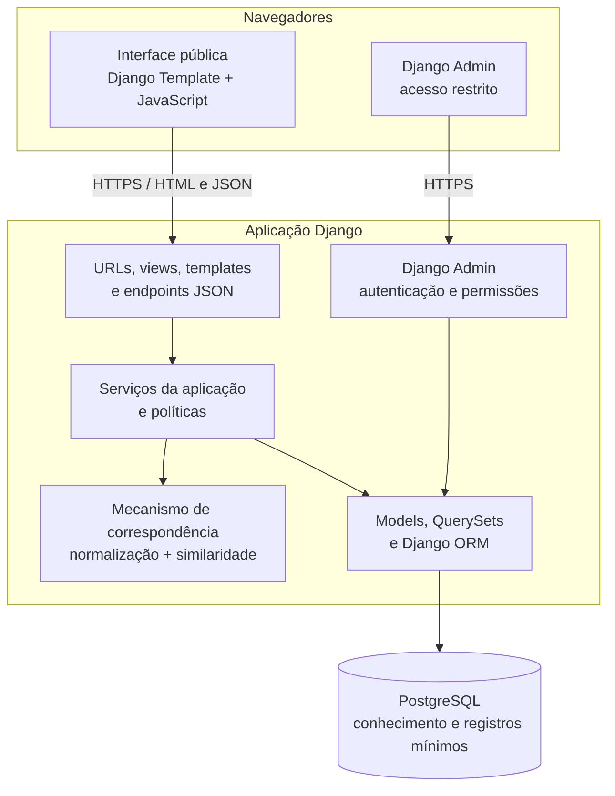
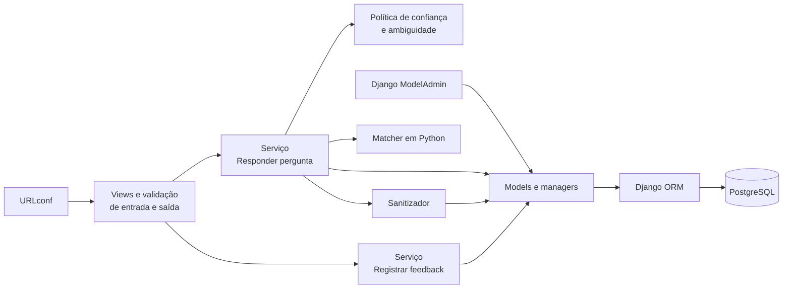
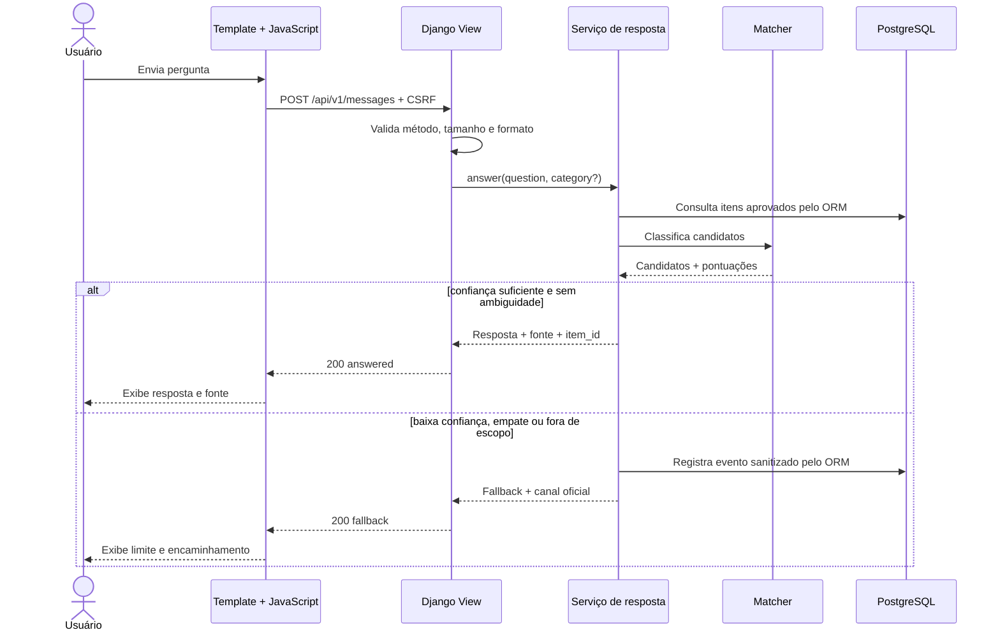
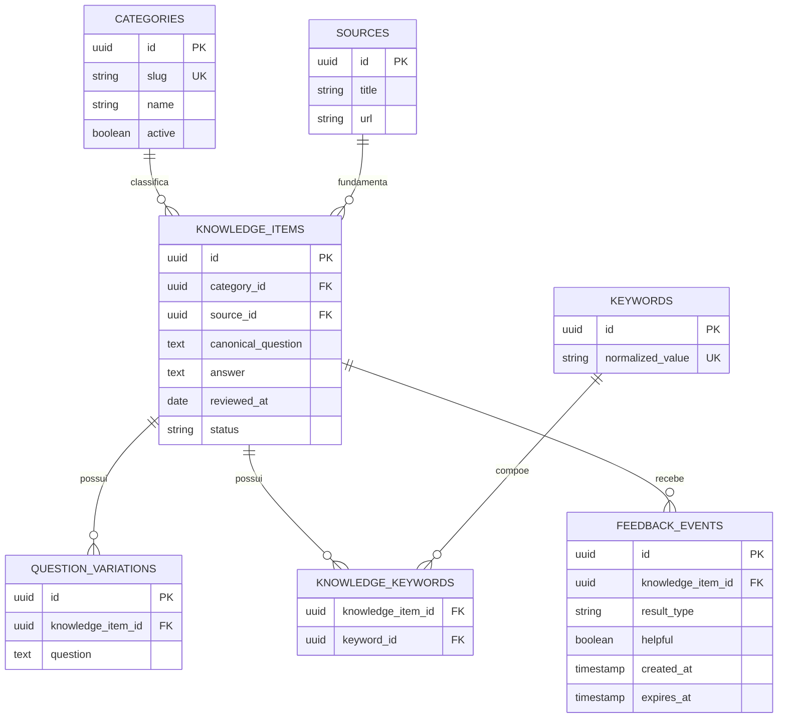
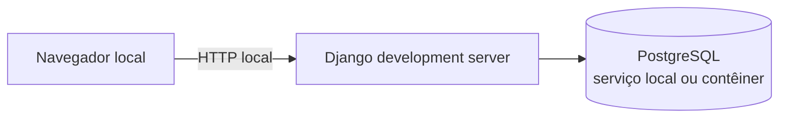
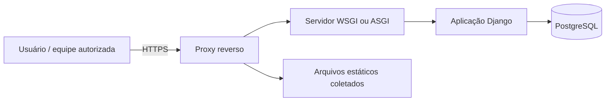
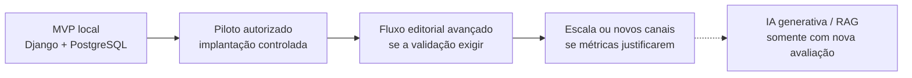

# Arquitetura do projeto — Chatbot AGINOV

## 1. Visão geral

Este documento descreve a arquitetura de referência do MVP do Chatbot AGINOV. A solução será uma aplicação web pequena, modular e executável localmente, voltada à recuperação de respostas previamente revisadas. Ela não produzirá respostas livres por IA generativa.

> **Estado:** arquitetura de referência. Django e PostgreSQL estão confirmados; bibliotecas auxiliares, parâmetros do matcher e forma de implantação ainda serão validados.

### Objetivos arquiteturais

- oferecer respostas rastreáveis até uma fonte institucional;
- retornar fallback quando a confiança for insuficiente ou a pergunta estiver fora do escopo;
- separar interface, regras de aplicação, mecanismo de correspondência e persistência;
- permitir trocar o algoritmo de correspondência sem reescrever as views ou o painel administrativo;
- manter o MVP simples, reproduzível e sem serviço externo pago;
- minimizar a coleta e a retenção de dados;
- permitir testes automatizados em cada camada;
- preservar um caminho de evolução sem antecipar complexidade.

### Fora do escopo arquitetural do MVP

- modelo de linguagem, RAG ou banco vetorial;
- microsserviços, filas e processamento distribuído;
- login ou perfis para usuários públicos;
- integração com WhatsApp;
- alta disponibilidade e escalabilidade de produção;
- painel editorial personalizado além do Django Admin.

## 2. Princípios

1. **Fallback é um resultado válido:** é preferível admitir incerteza a apresentar uma orientação potencialmente incorreta.
2. **Conteúdo e código são separados:** respostas podem ser revisadas sem alteração das regras da aplicação.
3. **Toda resposta possui origem:** itens ativos devem conter fonte e data de revisão.
4. **Privacidade por padrão:** o sistema funciona sem identificar o usuário e sem armazenar conversas completas.
5. **Dependências apontam para o núcleo:** regras de negócio não dependem do framework web ou do PostgreSQL.
6. **Complexidade justificada por evidência:** tecnologias adicionais entram apenas quando uma limitação medida exigir.
7. **Acessibilidade faz parte da arquitetura:** semântica, teclado, foco e mensagens de estado não são acabamento posterior.

## 3. Contexto do sistema



O protótipo não consulta automaticamente sistemas internos da Universidade. As fontes oficiais são coletadas e revisadas antes de serem incorporadas à base controlada.

## 4. Contêineres da solução



| Contêiner | Responsabilidade | Tecnologia proposta |
| --- | --- | --- |
| Interface pública | interação, acessibilidade e apresentação segura das respostas | Django Templates, HTML5, CSS3 e JavaScript |
| Camada web | páginas, endpoints JSON, validação de entrada e composição das respostas | Django |
| Administração interna | gestão de categorias, conteúdo, fontes e status por pessoas autorizadas | Django Admin |
| Núcleo | executar casos de uso e políticas de confiança, fallback e registro | Python independente do framework |
| Matcher | normalizar perguntas, gerar candidatos e calcular pontuações | biblioteca local de PLN/similaridade a definir |
| Persistência | mapear entidades, aplicar migrações e consultar dados | Django ORM + PostgreSQL |

Interface pública, endpoints JSON e administração serão entregues pela mesma aplicação Django e pela mesma origem. No repositório, `backend/` concentrará a aplicação Django e `frontend/` reunirá templates e arquivos estáticos. Essa organização física não altera a arquitetura de implantação: o sistema continuará sendo um monólito simples.

## 5. Componentes internos do backend



### Responsabilidades

- **URLconf:** mapear URLs para views sem conter regras de negócio.
- **Views e validação:** validar método, CSRF, tamanho e formato dos dados e manter o contrato HTTP explícito.
- **Responder pergunta:** orquestrar busca, confiança, fallback e resposta final.
- **Política de confiança:** decidir se o melhor candidato é suficiente e não ambíguo.
- **Matcher:** retornar candidatos ordenados com pontuação e explicação técnica.
- **Models/managers:** representar a base relacional e entregar somente itens ativos e válidos.
- **Django Admin:** permitir manutenção interna com autenticação, permissões, filtros e campos controlados.
- **Sanitizador:** remover ou bloquear conteúdo incompatível com o protocolo de privacidade antes da persistência.

O matcher e as políticas de confiança permanecerão como Python puro. Views e ModelAdmin não conterão o algoritmo, e o acesso ao PostgreSQL ocorrerá pelo ORM do Django. Essa separação permite testar a regra científica sem iniciar o servidor web.

## 6. Componentes do frontend

O frontend ficará em `frontend/` e será entregue por Django Templates e arquivos estáticos, organizado por responsabilidade:

- **template público:** estrutura semântica da página, aviso e token CSRF;
- **HTTP client:** comunicação com endpoints da mesma origem, timeout e tradução de erros;
- **chat controller:** estado da conversa atual apenas em memória;
- **message renderer:** criação segura das mensagens, sem inserir HTML vindo dos endpoints;
- **category selector:** descoberta e seleção opcional de categoria;
- **feedback control:** envio de avaliação simples;
- **accessibility announcer:** comunicação de carregamento, resposta e erro por região viva;
- **configuração:** valores públicos injetados pelo template, sem segredos.

O navegador não deverá persistir texto de perguntas em `localStorage`, cookies ou ferramentas analíticas no MVP.

## 7. Fluxo principal de resposta



### Pipeline de correspondência

1. Validar a entrada e aplicar limite de tamanho.
2. Normalizar caixa, espaços, pontuação e acentuação conforme decisão experimental.
3. Gerar candidatos por categoria, palavras-chave e variações cadastradas.
4. Calcular pontuação textual para cada candidato.
5. Comparar a maior pontuação com o limite configurado.
6. Verificar a diferença entre os primeiros candidatos para detectar ambiguidade.
7. Responder apenas quando as duas políticas forem satisfeitas; caso contrário, aplicar fallback.

A pontuação representa similaridade técnica, não probabilidade real de a resposta estar correta. Limite, margem de ambiguidade, pesos e normalização deverão ser configuráveis e avaliados com conjuntos separados de ajuste e teste.

## 8. Interfaces HTTP

O Django servirá a página pública, o painel interno e os endpoints JSON pela mesma origem. Os endpoints de interação serão versionados sob `/api/v1`; o contrato poderá ser refinado antes da Sprint 5. Para o escopo pequeno, serão usadas views Django e `JsonResponse`. Uma biblioteca adicional de API só será adotada se surgir necessidade comprovada.

| Método e rota | Finalidade | Persistência |
| --- | --- | --- |
| `GET /` | renderizar o chatbot e fornecer o token CSRF | nenhuma |
| `GET/POST /admin/` | autenticar a equipe e administrar conteúdo autorizado | conhecimento e auditoria administrativa |
| `GET /api/v1/health` | verificar se a API está disponível | nenhuma |
| `GET /api/v1/categories` | listar categorias ativas | nenhuma |
| `POST /api/v1/messages` | responder ou retornar fallback | somente evento sanitizado quando previsto |
| `POST /api/v1/feedback` | registrar utilidade da resposta | feedback mínimo |

### Exemplo de pergunta

```json
{
  "question": "Como posso obter orientação sobre propriedade intelectual?",
  "category": "propriedade-intelectual"
}
```

### Exemplo de resposta encontrada

```json
{
  "status": "answered",
  "message": "Resposta institucional previamente revisada.",
  "knowledge_item_id": "kb_001",
  "category": "propriedade-intelectual",
  "source": {
    "title": "Título da fonte oficial",
    "url": "https://dominio-institucional.example/pagina",
    "reviewed_at": "AAAA-MM-DD"
  },
  "feedback_token": "token-efemero"
}
```

### Exemplo de fallback

```json
{
  "status": "fallback",
  "message": "Não encontrei uma resposta segura na base disponível.",
  "official_channel": {
    "label": "Consulte os canais oficiais da AGINOV",
    "url": "https://dominio-institucional.example/contato"
  },
  "feedback_token": "token-efemero"
}
```

O texto e os endereços dos exemplos são marcadores, não conteúdo oficial. O `feedback_token` deve ser aleatório, curto, temporário e sem informação do usuário; sua necessidade será confirmada na implementação.

### Erros previstos

- `400`: JSON ou parâmetro inválido;
- `413`: pergunta acima do limite permitido;
- `422`: conteúdo ausente ou incompatível com o esquema;
- `429`: limite de requisições excedido, se a proteção estiver habilitada;
- `500`: erro interno sem exposição de detalhes técnicos;
- `503`: base de conhecimento indisponível ou inválida.

## 9. Modelo de dados

### Modelo relacional proposto



Valores de `knowledge_items.status`: `draft`, `approved`, `expired` e `archived`. Somente `approved`, com campos válidos e revisão vigente, poderá participar da busca. Restrições, chaves estrangeiras e índices devem preservar integridade e tornar as consultas do matcher previsíveis.

### Tabelas de eventos

**`unanswered_events`**

- `id`: identificador aleatório;
- `sanitized_question`: texto somente se o protocolo permitir e a sanitização for bem-sucedida;
- `candidate_category`: categoria sugerida, quando houver;
- `best_score_bucket`: faixa de pontuação, evitando precisão desnecessária;
- `fallback_reason`: baixa confiança, ambiguidade, fora de escopo ou erro controlado;
- `created_at`: data e hora;
- `expires_at`: prazo para exclusão.

**`feedback_events`**

- `id`: identificador aleatório;
- `knowledge_item_id`: item avaliado ou nulo no fallback;
- `result_type`: resposta ou fallback;
- `helpful`: valor booleano;
- `created_at`: data e hora;
- `expires_at`: prazo para exclusão.

As tabelas de interação pública não armazenarão IP, nome, e-mail, documento, localização precisa, identificador de dispositivo, texto de perguntas respondidas ou histórico completo de conversa por padrão. As contas administrativas do Django são separadas e limitadas à equipe autorizada.

## 10. Segurança, privacidade e fronteiras de confiança

| Risco | Controle arquitetural |
| --- | --- |
| script ou HTML na pergunta/conteúdo | renderização por texto, escape de saída e política de conteúdo |
| entrada excessiva ou automação abusiva | limite de tamanho, timeout e rate limit proporcional |
| vazamento de detalhes internos | mensagens públicas genéricas e logs técnicos controlados |
| conteúdo incorreto ou vencido | esquema, status, fonte, data de revisão e validação na inicialização |
| registro de dado pessoal | aviso, sanitização, descarte seguro e retenção limitada |
| dependência ou configuração vulnerável | versões fixadas, auditoria e segredos fora do repositório |
| requisição forjada ou origem indevida | mesma origem, proteção CSRF do Django e origens confiáveis explícitas |
| acesso indevido ao painel | autenticação Django, `is_staff`, permissões por modelo e HTTPS |
| alteração não rastreada da base | migrations versionadas, permissões do Admin e campos de revisão do conteúdo |

Requisitos adicionais:

- HTTPS em qualquer ambiente acessível por rede;
- cabeçalhos de segurança, incluindo CSP quando aplicável;
- ausência de segredo no frontend e no repositório;
- consultas parametrizadas pelo Django ORM; SQL manual somente com justificativa e parâmetros;
- usuário e papel do PostgreSQL com privilégios mínimos necessários;
- `DEBUG=False`, `ALLOWED_HOSTS`, cookies seguros e demais verificações de `check --deploy` no ambiente publicado;
- logs sem corpo integral de requisição;
- procedimento documentado de retenção, exportação agregada e exclusão;
- conteúdo oficial exibido como texto, nunca executado como marcação.

## 11. Requisitos não funcionais

| Atributo | Decisão ou objetivo do MVP |
| --- | --- |
| Usabilidade | linguagem clara, fluxo curto e estado atual visível |
| Acessibilidade | HTML semântico, teclado, foco, contraste e anúncios de estado |
| Desempenho | processamento local com p95 inicial de até 1 segundo |
| Confiabilidade | falhar de modo seguro quando a base estiver inválida ou indisponível |
| Manutenibilidade | módulos pequenos, tipagem, validação e testes por camada |
| Portabilidade | execução local documentada e configuração por ambiente |
| Auditabilidade | fonte e revisão ligadas à resposta e decisões registradas |
| Privacidade | nenhuma identificação necessária e persistência minimizada |

As metas quantitativas completas estão no [planejamento](PLANEJAMENTO.md).

## 12. Estrutura de diretórios proposta

```text
chatbot-aginov/
├── config/
│   ├── settings/
│   │   ├── base.py           # configuração compartilhada
│   │   ├── development.py    # ambiente local
│   │   └── production.py     # ambiente publicado
│   ├── urls.py               # rotas principais
│   ├── asgi.py
│   └── wsgi.py
├── apps/
│   ├── chat/
│   │   ├── services/         # resposta, confiança e sanitização
│   │   ├── matcher/          # normalização e similaridade
│   │   ├── views.py          # página e endpoints JSON
│   │   └── urls.py
│   ├── knowledge/
│   │   ├── models.py         # categorias, respostas, fontes e variações
│   │   ├── admin.py          # gestão interna do conteúdo
│   │   └── migrations/
│   └── interactions/
│       ├── models.py         # feedback e perguntas não atendidas
│       ├── admin.py
│       └── migrations/
├── templates/
│   └── chat/index.html
├── static/
│   └── chat/                 # CSS, JavaScript e imagens da interface
├── data/
│   ├── seeds/                # carga inicial revisada
│   └── samples/              # somente dados fictícios
├── docs/
│   ├── ARQUITETURA.md
│   └── PLANEJAMENTO.md
├── tests/
│   ├── unit/
│   ├── integration/
│   ├── contract/
│   └── evaluation/           # conjunto reservado e métricas
├── manage.py
└── README.md
```

### Regra de dependência

```text
urls ──> views ──> services ──> matcher/policies
             │          │
             │          └────> models/managers ──> Django ORM ──> PostgreSQL
             └───────────────> templates
admin ───────────────────────> models/managers
```

Views e classes `ModelAdmin` não implementam o algoritmo de correspondência. O matcher e as políticas não importam views, templates ou objetos de requisição Django. Models concentram integridade relacional, enquanto services orquestram os casos de uso.

## 13. Configuração

Configurações previstas, com nomes definitivos a confirmar:

- `SECRET_KEY`, `DEBUG`, `ALLOWED_HOSTS` e origens CSRF por ambiente;
- URL de conexão com o PostgreSQL, fornecida por variável de ambiente;
- limite e margem de confiança;
- tamanho máximo da pergunta;
- política e prazo de retenção;
- canal oficial de fallback;
- diretórios e estratégia de arquivos estáticos;
- nível de log e modo de execução.

O Django deverá interromper a inicialização com mensagem clara se uma configuração obrigatória estiver inválida. Segredos não terão valor padrão inseguro, e a publicação exigirá a execução de `manage.py check --deploy` com os settings de produção.

## 14. Implantação

### Desenvolvimento e avaliação local



O servidor de desenvolvimento será usado somente localmente. É o único cenário necessário para construir e avaliar o MVP.

### Possível piloto institucional futuro



Um piloto dependerá de aprovação e deverá usar servidor WSGI/ASGI adequado, proxy HTTPS, `collectstatic`, política de backup e retenção, monitoramento, gestão segura das credenciais do PostgreSQL e análise institucional de segurança e privacidade. `manage.py runserver` não será usado em produção.

## 15. Observabilidade e avaliação

O MVP produzirá eventos técnicos mínimos, sem conteúdo integral das conversas:

- inicialização e validação da base;
- quantidade agregada de respostas e fallbacks;
- motivo agregado do fallback;
- distribuição de tempo de processamento;
- erros por tipo e rota;
- avaliações agregadas de utilidade;
- versão da aplicação e revisão do conteúdo usada na avaliação.

Métricas de pesquisa devem ser geradas de forma reproduzível a partir de dados autorizados. Logs operacionais não substituem o conjunto de avaliação controlado.

## 16. Estratégia de testes arquiteturais

- **Domínio:** política de confiança, ambiguidade e validade do conteúdo sem I/O.
- **Serviços:** casos de resposta, fallback e feedback com dados controlados.
- **Models:** constraints, managers, migrations, retenção e integração PostgreSQL.
- **Views:** métodos, CSRF, validação, status HTTP e contratos JSON usando o cliente de testes do Django.
- **Admin:** autenticação, permissões, filtros, campos editáveis e transições de status.
- **Integração:** fluxo real com banco de teste isolado criado pelo Django.
- **Frontend:** template, renderização segura, estados, teclado e comportamento com erro do endpoint.
- **Avaliação:** conjunto reservado, cálculo das métricas e reprodutibilidade.

## 17. Decisões arquiteturais

| ID | Decisão | Motivo | Estado |
| --- | --- | --- | --- |
| ADR-001 | monólito modular | menor custo operacional e separação lógica suficiente | Confirmada |
| ADR-002 | Django como aplicação web | integrar páginas, endpoints, ORM, migrações, autenticação e administração | Confirmada |
| ADR-003 | Django Templates e JavaScript sem framework SPA | interface pequena, mesma origem e menor complexidade | Confirmada |
| ADR-004 | conhecimento em PostgreSQL | centralizar integridade, consultas e evolução dos dados do projeto | Confirmada |
| ADR-005 | eventos mínimos em PostgreSQL | banco relacional definido para desenvolvimento e possível evolução do projeto | Confirmada |
| ADR-006 | correspondência determinística | explicabilidade, custo e alinhamento ao escopo científico | Proposta |
| ADR-007 | fallback por confiança e ambiguidade | reduzir respostas indevidas | Proposta |
| ADR-008 | não armazenar conversas completas | minimização de dados e redução de risco | Proposta |
| ADR-009 | Django Admin para gestão interna básica | evitar construir painel próprio e restringir edição a pessoas autorizadas | Confirmada |

Quando uma decisão for confirmada, substituída ou rejeitada, deverá receber contexto, consequências, data e responsável em um registro ADR próprio. Alterar uma decisão não significa apagar seu histórico.

## 18. Caminho de evolução



Cada evolução exige evidência de necessidade e nova análise de risco. Em especial, IA generativa, integrações externas e dados institucionais não são extensões automáticas do MVP.

## 19. Pontos pendentes de validação

1. Escolher a versão estável/LTS do Django compatível com o calendário do projeto.
2. Escolher e avaliar a biblioteca de similaridade textual.
3. Definir categorias, conteúdo inicial e responsáveis pela revisão.
4. Definir validade das revisões e comportamento para links indisponíveis.
5. Aprovar limite, margem de ambiguidade e conjunto de avaliação.
6. Aprovar se perguntas sanitizadas podem ser persistidas e por quanto tempo.
7. Confirmar a necessidade do token efêmero de feedback.
8. Definir o canal oficial exibido no fallback.
9. Decidir se haverá apenas execução local ou algum ambiente de demonstração.
10. Definir a versão do driver `psycopg` e, para eventual piloto, o servidor WSGI ou ASGI.
