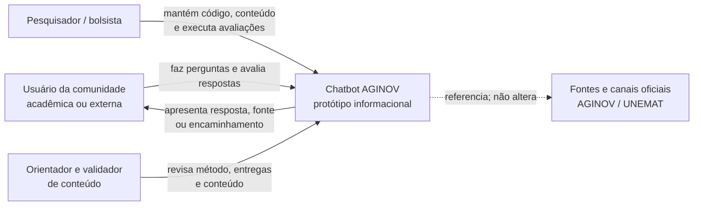
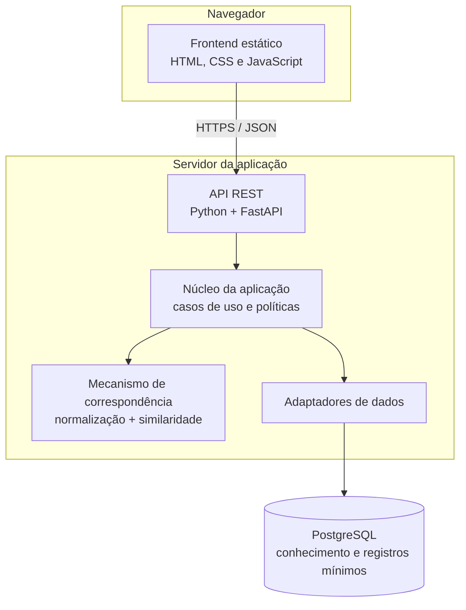
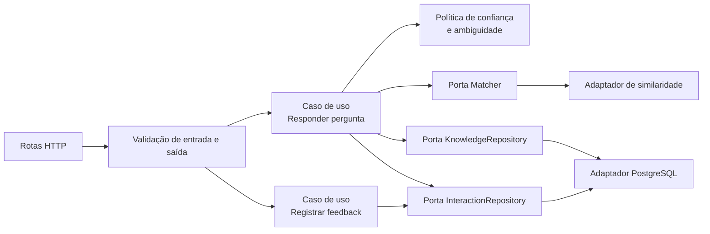
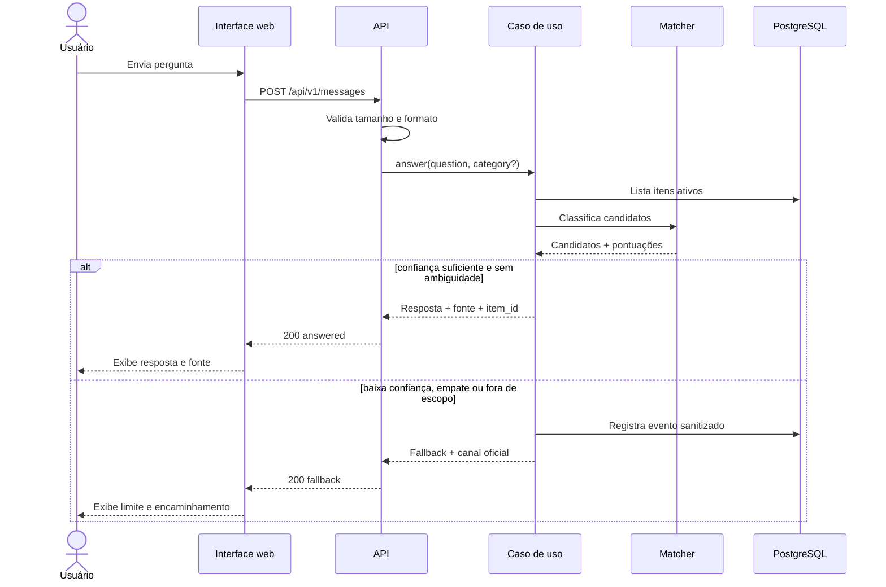
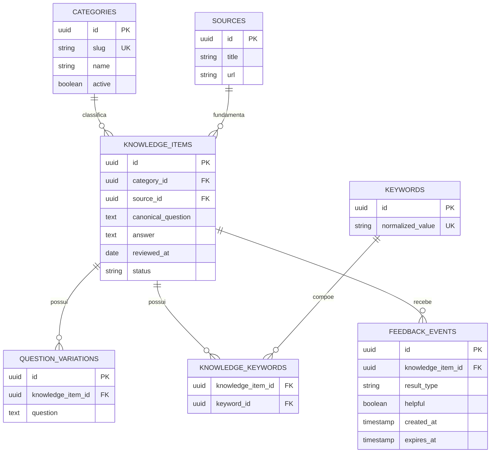
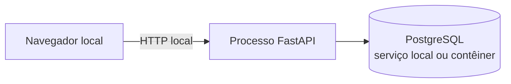
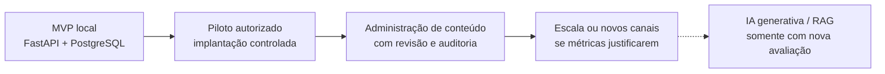

# Arquitetura do projeto — Chatbot AGINOV

## 1. Visão geral

Este documento descreve a arquitetura de referência do MVP do Chatbot AGINOV. A solução será uma aplicação web pequena, modular e executável localmente, voltada à recuperação de respostas previamente revisadas. Ela não produzirá respostas livres por IA generativa.

> **Estado:** arquitetura proposta. As decisões serão confirmadas durante o levantamento de requisitos e registradas antes da implementação.

### Objetivos arquiteturais

- oferecer respostas rastreáveis até uma fonte institucional;
- retornar fallback quando a confiança for insuficiente ou a pergunta estiver fora do escopo;
- separar interface, regras de aplicação, mecanismo de correspondência e persistência;
- permitir trocar o algoritmo de correspondência sem reescrever a API;
- manter o MVP simples, reproduzível e sem serviço externo pago;
- minimizar a coleta e a retenção de dados;
- permitir testes automatizados em cada camada;
- preservar um caminho de evolução sem antecipar complexidade.

### Fora do escopo arquitetural do MVP

- modelo de linguagem, RAG ou banco vetorial;
- microsserviços, filas e processamento distribuído;
- login, perfis de usuário ou controle administrativo;
- integração com WhatsApp;
- alta disponibilidade e escalabilidade de produção;
- edição da base por interface gráfica.

## 2. Princípios

1. **Fallback é um resultado válido:** é preferível admitir incerteza a apresentar uma orientação potencialmente incorreta.
2. **Conteúdo e código são separados:** respostas podem ser revisadas sem alteração das regras da aplicação.
3. **Toda resposta possui origem:** itens ativos devem conter fonte e data de revisão.
4. **Privacidade por padrão:** o sistema funciona sem identificar o usuário e sem armazenar conversas completas.
5. **Dependências apontam para o núcleo:** regras de negócio não dependem do framework web ou do PostgreSQL.
6. **Complexidade justificada por evidência:** tecnologias adicionais entram apenas quando uma limitação medida exigir.
7. **Acessibilidade faz parte da arquitetura:** semântica, teclado, foco e mensagens de estado não são acabamento posterior.

## 3. Contexto do sistema



O protótipo não consulta automaticamente sistemas internos da Universidade. As fontes oficiais são coletadas e revisadas antes de serem incorporadas à base controlada.

## 4. Contêineres da solução



| Contêiner | Responsabilidade | Tecnologia proposta |
| --- | --- | --- |
| Frontend | interação, acessibilidade e apresentação segura das respostas | HTML5, CSS3 e JavaScript |
| API | contrato HTTP, validação de entrada e composição das respostas | Python e FastAPI |
| Núcleo | executar casos de uso e políticas de confiança, fallback e registro | Python independente do framework |
| Matcher | normalizar perguntas, gerar candidatos e calcular pontuações | biblioteca local de PLN/similaridade a definir |
| Banco de dados | armazenar conhecimento aprovado, feedback agregado e perguntas sanitizadas não atendidas | PostgreSQL |

Para o MVP, API e frontend podem ser publicados no mesmo processo/origem. A separação acima é lógica; ela não exige servidores distintos.

## 5. Componentes internos do backend



### Responsabilidades

- **Rotas:** mapear HTTP para casos de uso, sem conter lógica de seleção de resposta.
- **DTOs/esquemas:** limitar tamanho e formato dos dados e manter o contrato explícito.
- **Responder pergunta:** orquestrar busca, confiança, fallback e resposta final.
- **Política de confiança:** decidir se o melhor candidato é suficiente e não ambíguo.
- **Matcher:** retornar candidatos ordenados com pontuação e explicação técnica.
- **Repositório de conhecimento:** entregar somente itens ativos e válidos.
- **Repositório de interações:** persistir eventos mínimos já sanitizados.
- **Sanitizador:** remover ou bloquear conteúdo incompatível com o protocolo de privacidade antes da persistência.

O domínio deve conhecer interfaces (portas), não FastAPI ou PostgreSQL. Isso permite testar as regras em memória e substituir adaptadores futuramente.

## 6. Componentes do frontend

O frontend será organizado por responsabilidade, mesmo sem framework:

- **API client:** comunicação HTTP, timeout e tradução de erros;
- **chat controller:** estado da conversa atual apenas em memória;
- **message renderer:** criação segura das mensagens, sem inserir HTML vindo da API;
- **category selector:** descoberta e seleção opcional de categoria;
- **feedback control:** envio de avaliação simples;
- **accessibility announcer:** comunicação de carregamento, resposta e erro por região viva;
- **configuration:** endereço da API e limites de interface sem segredos.

O navegador não deverá persistir texto de perguntas em `localStorage`, cookies ou ferramentas analíticas no MVP.

## 7. Fluxo principal de resposta



### Pipeline de correspondência

1. Validar a entrada e aplicar limite de tamanho.
2. Normalizar caixa, espaços, pontuação e acentuação conforme decisão experimental.
3. Gerar candidatos por categoria, palavras-chave e variações cadastradas.
4. Calcular pontuação textual para cada candidato.
5. Comparar a maior pontuação com o limite configurado.
6. Verificar a diferença entre os primeiros candidatos para detectar ambiguidade.
7. Responder apenas quando as duas políticas forem satisfeitas; caso contrário, aplicar fallback.

A pontuação representa similaridade técnica, não probabilidade real de a resposta estar correta. Limite, margem de ambiguidade, pesos e normalização deverão ser configuráveis e avaliados com conjuntos separados de ajuste e teste.

## 8. Contrato inicial da API

Todos os endpoints serão versionados sob `/api/v1`. O contrato poderá ser refinado antes da Sprint 5.

| Método e rota | Finalidade | Persistência |
| --- | --- | --- |
| `GET /api/v1/health` | verificar se a API está disponível | nenhuma |
| `GET /api/v1/categories` | listar categorias ativas | nenhuma |
| `POST /api/v1/messages` | responder ou retornar fallback | somente evento sanitizado quando previsto |
| `POST /api/v1/feedback` | registrar utilidade da resposta | feedback mínimo |

### Exemplo de pergunta

```json
{
  "question": "Como posso obter orientação sobre propriedade intelectual?",
  "category": "propriedade-intelectual"
}
```

### Exemplo de resposta encontrada

```json
{
  "status": "answered",
  "message": "Resposta institucional previamente revisada.",
  "knowledge_item_id": "kb_001",
  "category": "propriedade-intelectual",
  "source": {
    "title": "Título da fonte oficial",
    "url": "https://dominio-institucional.example/pagina",
    "reviewed_at": "AAAA-MM-DD"
  },
  "feedback_token": "token-efemero"
}
```

### Exemplo de fallback

```json
{
  "status": "fallback",
  "message": "Não encontrei uma resposta segura na base disponível.",
  "official_channel": {
    "label": "Consulte os canais oficiais da AGINOV",
    "url": "https://dominio-institucional.example/contato"
  },
  "feedback_token": "token-efemero"
}
```

O texto e os endereços dos exemplos são marcadores, não conteúdo oficial. O `feedback_token` deve ser aleatório, curto, temporário e sem informação do usuário; sua necessidade será confirmada na implementação.

### Erros previstos

- `400`: JSON ou parâmetro inválido;
- `413`: pergunta acima do limite permitido;
- `422`: conteúdo ausente ou incompatível com o esquema;
- `429`: limite de requisições excedido, se a proteção estiver habilitada;
- `500`: erro interno sem exposição de detalhes técnicos;
- `503`: base de conhecimento indisponível ou inválida.

## 9. Modelo de dados

### Modelo relacional proposto



Valores de `knowledge_items.status`: `draft`, `approved`, `expired` e `archived`. Somente `approved`, com campos válidos e revisão vigente, poderá participar da busca. Restrições, chaves estrangeiras e índices devem preservar integridade e tornar as consultas do matcher previsíveis.

### Tabelas de eventos

**`unanswered_events`**

- `id`: identificador aleatório;
- `sanitized_question`: texto somente se o protocolo permitir e a sanitização for bem-sucedida;
- `candidate_category`: categoria sugerida, quando houver;
- `best_score_bucket`: faixa de pontuação, evitando precisão desnecessária;
- `fallback_reason`: baixa confiança, ambiguidade, fora de escopo ou erro controlado;
- `created_at`: data e hora;
- `expires_at`: prazo para exclusão.

**`feedback_events`**

- `id`: identificador aleatório;
- `knowledge_item_id`: item avaliado ou nulo no fallback;
- `result_type`: resposta ou fallback;
- `helpful`: valor booleano;
- `created_at`: data e hora;
- `expires_at`: prazo para exclusão.

Não serão armazenados IP, nome, e-mail, documento, localização precisa, identificador de dispositivo, texto de perguntas respondidas ou histórico completo de conversa por padrão.

## 10. Segurança, privacidade e fronteiras de confiança

| Risco | Controle arquitetural |
| --- | --- |
| script ou HTML na pergunta/conteúdo | renderização por texto, escape de saída e política de conteúdo |
| entrada excessiva ou automação abusiva | limite de tamanho, timeout e rate limit proporcional |
| vazamento de detalhes internos | mensagens públicas genéricas e logs técnicos controlados |
| conteúdo incorreto ou vencido | esquema, status, fonte, data de revisão e validação na inicialização |
| registro de dado pessoal | aviso, sanitização, descarte seguro e retenção limitada |
| dependência ou configuração vulnerável | versões fixadas, auditoria e segredos fora do repositório |
| acesso entre origens indevidas | mesma origem no MVP ou lista CORS restrita |
| alteração não rastreada da base | migrações versionadas, papéis restritos e trilha de revisão do conteúdo |

Requisitos adicionais:

- HTTPS em qualquer ambiente acessível por rede;
- cabeçalhos de segurança, incluindo CSP quando aplicável;
- ausência de segredo no frontend e no repositório;
- consultas PostgreSQL parametrizadas por meio do driver ou ORM adotado;
- usuário e papel do PostgreSQL com privilégios mínimos necessários;
- logs sem corpo integral de requisição;
- procedimento documentado de retenção, exportação agregada e exclusão;
- conteúdo oficial exibido como texto, nunca executado como marcação.

## 11. Requisitos não funcionais

| Atributo | Decisão ou objetivo do MVP |
| --- | --- |
| Usabilidade | linguagem clara, fluxo curto e estado atual visível |
| Acessibilidade | HTML semântico, teclado, foco, contraste e anúncios de estado |
| Desempenho | processamento local com p95 inicial de até 1 segundo |
| Confiabilidade | falhar de modo seguro quando a base estiver inválida ou indisponível |
| Manutenibilidade | módulos pequenos, tipagem, validação e testes por camada |
| Portabilidade | execução local documentada e configuração por ambiente |
| Auditabilidade | fonte e revisão ligadas à resposta e decisões registradas |
| Privacidade | nenhuma identificação necessária e persistência minimizada |

As metas quantitativas completas estão no [planejamento](PLANEJAMENTO.md).

## 12. Estrutura de diretórios proposta

```text
chatbot-aginov/
├── app/
│   ├── api/                  # rotas, dependências e esquemas HTTP
│   ├── application/          # casos de uso e portas
│   ├── domain/               # entidades e políticas puras
│   ├── infrastructure/       # PostgreSQL e matcher concreto
│   ├── config.py             # configuração validada por ambiente
│   └── main.py               # composição e inicialização
├── frontend/
│   ├── assets/
│   ├── scripts/
│   ├── styles/
│   └── index.html
├── data/
│   ├── seeds/                # carga inicial revisada
│   └── samples/              # somente dados fictícios
├── docs/
│   ├── ARQUITETURA.md
│   └── PLANEJAMENTO.md
├── tests/
│   ├── unit/
│   ├── integration/
│   ├── contract/
│   └── evaluation/           # conjunto reservado e métricas
└── README.md
```

### Regra de dependência

```text
api ───────> application ───────> domain
                    ^
                    |
infrastructure -----+
```

O domínio não importa módulos de `api` ou `infrastructure`. A camada de composição conecta implementações concretas às portas dos casos de uso.

## 13. Configuração

Configurações previstas, com nomes definitivos a confirmar:

- URL de conexão com o PostgreSQL, fornecida por variável de ambiente;
- limite e margem de confiança;
- tamanho máximo da pergunta;
- política e prazo de retenção;
- canal oficial de fallback;
- origem permitida do frontend;
- nível de log e modo de execução.

O programa deverá interromper a inicialização com mensagem clara se uma configuração obrigatória ou a base ativa estiver inválida. Segredos não devem possuir valor padrão inseguro.

## 14. Implantação

### Desenvolvimento e avaliação local



É o único cenário necessário para demonstrar e avaliar o MVP.

### Possível piloto institucional futuro

Um piloto dependerá de aprovação e deverá acrescentar proxy HTTPS, política de backup e retenção, monitoramento, execução em contêiner, gestão segura das credenciais do PostgreSQL e análise institucional de segurança e privacidade.

## 15. Observabilidade e avaliação

O MVP produzirá eventos técnicos mínimos, sem conteúdo integral das conversas:

- inicialização e validação da base;
- quantidade agregada de respostas e fallbacks;
- motivo agregado do fallback;
- distribuição de tempo de processamento;
- erros por tipo e rota;
- avaliações agregadas de utilidade;
- versão da aplicação e da base usada na avaliação.

Métricas de pesquisa devem ser geradas de forma reproduzível a partir de dados autorizados. Logs operacionais não substituem o conjunto de avaliação controlado.

## 16. Estratégia de testes arquiteturais

- **Domínio:** política de confiança, ambiguidade e validade do conteúdo sem I/O.
- **Aplicação:** casos de resposta, fallback e feedback com adaptadores em memória.
- **Infraestrutura:** repositórios e migrações PostgreSQL, sanitização e matcher.
- **Contrato:** esquemas, status HTTP e compatibilidade do frontend com a API.
- **Integração:** fluxo real com arquivos temporários e banco isolado.
- **Frontend:** renderização segura, estados, teclado e comportamento com erro da API.
- **Avaliação:** conjunto reservado, cálculo das métricas e reprodutibilidade.

## 17. Decisões arquiteturais

| ID | Decisão proposta | Motivo | Estado |
| --- | --- | --- | --- |
| ADR-001 | monólito modular | menor custo operacional e separação lógica suficiente | Proposta |
| ADR-002 | FastAPI no backend | tipagem, validação e documentação automática do contrato | Proposta |
| ADR-003 | frontend sem framework | interface pequena e menor complexidade no MVP | Proposta |
| ADR-004 | conhecimento em PostgreSQL | centralizar integridade, consultas e evolução dos dados do projeto | Confirmada |
| ADR-005 | eventos mínimos em PostgreSQL | banco relacional definido para desenvolvimento e possível evolução do projeto | Confirmada |
| ADR-006 | correspondência determinística | explicabilidade, custo e alinhamento ao escopo científico | Proposta |
| ADR-007 | fallback por confiança e ambiguidade | reduzir respostas indevidas | Proposta |
| ADR-008 | não armazenar conversas completas | minimização de dados e redução de risco | Proposta |

Quando uma decisão for confirmada, substituída ou rejeitada, deverá receber contexto, consequências, data e responsável em um registro ADR próprio. Alterar uma decisão não significa apagar seu histórico.

## 18. Caminho de evolução



Cada evolução exige evidência de necessidade e nova análise de risco. Em especial, IA generativa, integrações externas e dados institucionais não são extensões automáticas do MVP.

## 19. Pontos pendentes de validação

1. Confirmar FastAPI como framework do backend.
2. Escolher e avaliar a biblioteca de similaridade textual.
3. Definir categorias, conteúdo inicial e responsáveis pela revisão.
4. Definir validade das revisões e comportamento para links indisponíveis.
5. Aprovar limite, margem de ambiguidade e conjunto de avaliação.
6. Aprovar se perguntas sanitizadas podem ser persistidas e por quanto tempo.
7. Confirmar a necessidade do token efêmero de feedback.
8. Definir o canal oficial exibido no fallback.
9. Decidir se haverá apenas execução local ou algum ambiente de demonstração.
10. Escolher driver, biblioteca de acesso e ferramenta de migração para PostgreSQL.
