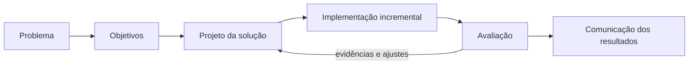

# Planejamento do projeto — Chatbot AGINOV

## 1. Finalidade deste documento

Este plano converte o subprojeto de pesquisa em uma execução incremental e verificável. Ele cobre o MVP, da descoberta do problema à avaliação e à comunicação dos resultados.

O cronograma usa **sprints de duas semanas**. As datas devem ser preenchidas após a confirmação do calendário da bolsa e da disponibilidade das pessoas responsáveis pela validação de conteúdo. A numeração abaixo permite começar o trabalho sem associar entregas a datas ainda não aprovadas.

## 2. Premissas e restrições

- O produto é um protótipo de pesquisa, e não um serviço institucional em produção.
- O conteúdo da base depende de fontes públicas ou autorizadas e de validação institucional.
- O bolsista é o principal responsável pela pesquisa, implementação, testes e documentação, sob orientação.
- A solução deve funcionar sem IA generativa e sem serviço externo pago.
- Nenhum dado pessoal é necessário para o funcionamento do MVP.
- Testes com usuários e uso de dados reais devem respeitar as autorizações e orientações éticas e institucionais aplicáveis.
- Mudanças relevantes de escopo devem ser registradas e aprovadas antes de entrar em uma sprint.

## 3. Estratégia de execução

O projeto combinará Design Science Research (DSR) e práticas ágeis:

Cada sprint deve terminar com um incremento demonstrável, evidências de verificação e atualização da documentação. A revisão com o orientador funciona como ponto de decisão sobre prioridade e continuidade.

## 4. Roadmap por fases

| Fase | Sprints | Resultado principal | Período do subprojeto |
| --- | --- | --- | --- |
| Preparação científica | 0–1 | Protocolo de trabalho e revisão bibliográfica inicial | 2026 |
| Descoberta e projeto | 2–3 | Requisitos, conteúdo inicial e fluxo conversacional | 2027 |
| Construção do MVP | 4–7 | Interface, API, base e mecanismo de resposta integrados | 2027 |
| Avaliação e consolidação | 8–10 | Testes, usabilidade, ajustes, documentação e apresentação | 2027 |

O roadmap segue o cronograma acadêmico fornecido. Se a execução técnica puder começar em 2026, as sprints 2 em diante podem ser antecipadas sem alterar a ordem de dependência.

## 5. Plano de sprints

### Sprint 0 — Iniciação e governança

**Objetivo:** estabelecer escopo, organização do repositório e forma de acompanhamento.

**Entregas:**

- termo de visão resumido;
- mapa de partes interessadas;
- arquitetura de referência e decisões técnicas iniciais;
- registro inicial de riscos e decisões;
- repositório, documentação e quadro de tarefas organizados;
- calendário preliminar de revisões com o orientador.

**Critérios de aceite:** objetivo, MVP, itens fora de escopo e papéis estão documentados; o orientador consegue revisar as decisões abertas; nenhuma entrega promete implantação oficial.

### Sprint 1 — Fundamentação e protocolo de pesquisa

**Objetivo:** consolidar as bases científicas e definir como o artefato será avaliado.

**Entregas:**

- revisão bibliográfica inicial sobre chatbots, PLN, usabilidade, DSR, qualidade e LGPD;
- fichamentos e matriz de literatura;
- questões de avaliação e indicadores;
- protocolo preliminar de coleta e análise de resultados;
- análise sobre necessidade de autorizações ou apreciação ética.

**Critérios de aceite:** referências estão organizadas; cada indicador se relaciona a um objetivo; o protocolo evita coleta desnecessária de dados pessoais.

### Sprint 2 — Requisitos e fontes institucionais

**Objetivo:** entender usuários, demandas, restrições e fontes confiáveis.

**Entregas:**

- perfis de usuários e jornadas essenciais;
- requisitos funcionais e não funcionais priorizados;
- inventário de páginas, documentos e canais oficiais;
- categorias candidatas e amostra de perguntas frequentes;
- matriz de rastreabilidade entre fonte, assunto e responsável pela revisão.

**Critérios de aceite:** requisitos são verificáveis; toda resposta candidata possui origem identificada; pendências de autorização estão separadas do conteúdo utilizável.

### Sprint 3 — Conversação, conteúdo e protótipo de baixa fidelidade

**Objetivo:** projetar a experiência antes da implementação.

**Entregas:**

- fluxo de saudação, categorias, pergunta livre, resposta, feedback e fallback;
- modelo de dados da base de conhecimento;
- guia de linguagem clara e tom de voz;
- wireframes responsivos;
- protótipo navegável de baixa fidelidade;
- primeira versão revisável da base de perguntas e respostas.

**Critérios de aceite:** todos os caminhos terminam em resposta segura ou encaminhamento; o aviso de privacidade é visível; conteúdo e wireframes passam por revisão do orientador e, quando disponível, de representante da AGINOV.

### Sprint 4 — Fundação técnica e interface web

**Objetivo:** criar o esqueleto executável e a interface conversacional responsiva.

**Entregas:**

- estrutura do frontend e da API;
- configurações reproduzíveis do ambiente;
- tela do chatbot para dispositivos móveis e desktop;
- estados de carregamento, erro, vazio e indisponibilidade;
- navegação por teclado e semântica HTML inicial;
- pipeline básico de verificação automatizada.

**Critérios de aceite:** o projeto executa a partir das instruções do README; a interface funciona nas larguras definidas; não depende apenas de cor; os estados principais podem ser demonstrados com dados simulados.

### Sprint 5 — Base de conhecimento e API

**Objetivo:** servir conteúdo estruturado e validado por uma API pequena e testável.

**Entregas:**

- esquema da base com identificador, categoria, pergunta canônica, variações, palavras-chave, resposta, fonte, revisão e status;
- carga e validação dos dados;
- endpoints de categorias, pergunta e feedback;
- tratamento consistente de erros;
- testes unitários do modelo e da API;
- documentação do contrato da API.

**Critérios de aceite:** entradas inválidas são rejeitadas; conteúdo não aprovado não é oferecido; os endpoints críticos têm testes; respostas incluem referência à fonte quando aplicável.

### Sprint 6 — Mecanismo de correspondência e confiança

**Objetivo:** selecionar respostas por técnica simples, mensurável e explicável.

**Entregas:**

- normalização textual;
- estratégia de palavras-chave e similaridade;
- limite de confiança configurável;
- conjunto de perguntas para treinamento/ajuste separado do conjunto de avaliação;
- fallback para resultados insuficientes ou ambíguos;
- relatório inicial de erros por categoria.

**Critérios de aceite:** a mesma entrada produz resultado determinístico; o mecanismo informa pontuação e regra usada nos registros técnicos; perguntas abaixo do limite não recebem resposta afirmativa; não há ajuste usando respostas do conjunto final de avaliação.

### Sprint 7 — Integração e proteção de dados

**Objetivo:** concluir o fluxo ponta a ponta e tratar registros com minimização.

**Entregas:**

- frontend integrado à API;
- avaliação “útil/não útil”;
- registro de pergunta sem resposta;
- sanitização e limites de tamanho/uso;
- aviso para não envio de dados pessoais;
- configuração de retenção e procedimento de exclusão;
- testes integrados dos fluxos críticos.

**Critérios de aceite:** pergunta, resposta, fallback e feedback funcionam ponta a ponta; falha da API é comunicada sem perder segurança; não são persistidos IP, identificador de dispositivo ou dados de perfil por padrão; registros potencialmente pessoais são descartados ou anonimizados conforme protocolo aprovado.

### Sprint 8 — Qualidade funcional, conteúdo e acessibilidade

**Objetivo:** verificar comportamento, segurança básica e qualidade das respostas.

**Entregas:**

- execução do plano de testes;
- avaliação do conjunto reservado de perguntas;
- inspeção de links, fontes e datas de revisão;
- testes de teclado, contraste, foco e leitores de tela nos fluxos principais;
- análise de falhas e correções priorizadas;
- versão candidata do MVP.

**Critérios de aceite:** todos os testes críticos passam; não há resposta sem fonte válida no conteúdo que exige referência; defeitos graves estão corrigidos; métricas são calculadas de forma reproduzível.

### Sprint 9 — Avaliação de usabilidade e refinamento

**Objetivo:** avaliar se a interação é compreensível e útil para o público pretendido.

**Entregas:**

- roteiro, termos e instrumentos de avaliação aprovados;
- sessões de avaliação ou, se elas não forem autorizadas, inspeção heurística documentada;
- resultados quantitativos e qualitativos anonimizados;
- lista de problemas por severidade;
- refinamentos de maior impacto no MVP.

**Critérios de aceite:** participantes e dados seguem o protocolo autorizado; achados estão ligados a evidências; mudanças são testadas novamente; limitações da amostra são registradas.

### Sprint 10 — Consolidação e comunicação

**Objetivo:** entregar artefato, documentação e resultados reproduzíveis.

**Entregas:**

- MVP consolidado e identificado por versão;
- README e tutorial de uso;
- documentação técnica e da base de conhecimento;
- relatório de testes, usabilidade, limitações e ameaças à validade;
- relatório final acadêmico;
- apresentação e roteiro opcional do vídeo de até 180 segundos;
- backlog recomendado para continuidade.

**Critérios de aceite:** outra pessoa consegue instalar, executar e testar seguindo a documentação; os resultados respondem aos objetivos; limitações e trabalhos futuros estão explícitos; materiais finais passam pela revisão do orientador.

## 6. Backlog priorizado do MVP

| ID | História ou capacidade | Prioridade | Sprint-alvo |
| --- | --- | --- | --- |
| US-01 | Como visitante, quero entender o papel e os limites do chatbot antes de usá-lo | Must | 3–4 |
| US-02 | Como visitante, quero navegar por categorias para descobrir os assuntos disponíveis | Must | 3–5 |
| US-03 | Como visitante, quero escrever uma dúvida em linguagem natural e obter orientação relacionada | Must | 5–7 |
| US-04 | Como visitante, quero ver a fonte da resposta para poder conferir a informação oficial | Must | 3–7 |
| US-05 | Como visitante, quero ser encaminhado corretamente quando o bot não souber responder | Must | 3–7 |
| US-06 | Como visitante, quero avaliar rapidamente se uma resposta foi útil | Should | 7 |
| US-07 | Como pesquisador, quero identificar assuntos não atendidos sem identificar o usuário | Must | 7–8 |
| US-08 | Como mantenedor, quero atualizar a base sem alterar o código da aplicação | Must | 5 |
| US-09 | Como mantenedor, quero validar automaticamente campos, fontes e duplicidades da base | Should | 5–8 |
| US-10 | Como usuário de tecnologia assistiva, quero operar os fluxos essenciais por teclado e leitor de tela | Must | 4–8 |
| US-11 | Como pesquisador, quero exportar métricas agregadas para avaliar o artefato | Should | 8–10 |
| US-12 | Como gestor, quero administrar conteúdo por painel autenticado | Won't no MVP | Futuro |
| US-13 | Como visitante, quero conversar pelo WhatsApp | Won't no MVP | Futuro |
| US-14 | Como visitante, quero respostas geradas por modelo de linguagem | Won't no MVP | Futuro |

“Must”, “Should” e “Won't” seguem a priorização MoSCoW. Itens “Won't” são deliberadamente excluídos do MVP, não esquecidos.

## 7. Modelo mínimo da base de conhecimento

Cada item deverá conter, no mínimo:

| Campo | Finalidade |
| --- | --- |
| `id` | Identificador estável e não semântico |
| `category` | Categoria de atendimento |
| `canonical_question` | Forma principal da pergunta |
| `variations` | Formulações alternativas aprovadas |
| `keywords` | Termos relevantes para correspondência |
| `answer` | Resposta clara, limitada e revisada |
| `source_title` | Nome legível da fonte |
| `source_url` | Endereço oficial, quando público |
| `reviewed_at` | Data da última conferência |
| `status` | Rascunho, aprovado, expirado ou arquivado |

Itens em rascunho, expirados ou arquivados não deverão ser apresentados como resposta do chatbot.

## 8. Qualidade e plano de testes

| Nível | O que verificar | Evidência |
| --- | --- | --- |
| Unitário | normalização, similaridade, confiança, sanitização e validação de dados | suíte automatizada |
| API | contratos, códigos de erro, limites e conteúdo retornado | testes automatizados de endpoint |
| Integração | pergunta → resposta/fallback → feedback/registro | cenários automatizados |
| Conteúdo | correção, clareza, fonte, validade e encaminhamento | checklist com revisão humana |
| Acessibilidade | teclado, foco, semântica, contraste e mensagens de estado | testes automáticos e inspeção manual |
| Desempenho | tempo da consulta local e comportamento sob carga compatível com o protótipo | relatório reproduzível |
| Usabilidade | compreensão, conclusão de tarefas, dificuldades e satisfação | protocolo e relatório anonimizados |
| Segurança/privacidade | entrada malformada, injeção de conteúdo, excesso de tamanho e dados pessoais | casos negativos e checklist |

### Conjunto de avaliação

O conjunto deverá incluir:

- perguntas idênticas às cadastradas;
- paráfrases não usadas no ajuste do mecanismo;
- erros ortográficos e variações curtas;
- perguntas ambíguas;
- perguntas fora de escopo;
- tentativas de inserir dados pessoais;
- conteúdo adversarial, scripts e entradas excessivamente longas.

Perguntas de ajuste e perguntas de avaliação final devem permanecer separadas para reduzir viés.

## 9. Métricas e metas iniciais

As metas abaixo são hipóteses de engenharia para o MVP. Devem ser aprovadas nas sprints 1 e 2 depois que o tamanho da base e o protocolo forem conhecidos.

| Métrica | Cálculo | Meta inicial proposta |
| --- | --- | --- |
| Adequação da resposta | respostas adequadas ÷ perguntas respondidas | ≥ 80% no conjunto reservado |
| Cobertura segura | perguntas adequadamente respondidas ÷ total de perguntas em escopo | ≥ 70% |
| Precisão do fallback | fallbacks corretos ÷ fallbacks acionados | ≥ 90% |
| Cobertura do fallback | perguntas que exigem fallback e foram detectadas ÷ perguntas que exigem fallback | ≥ 90% |
| Fluxos críticos | cenários críticos aprovados ÷ cenários críticos | 100% |
| Rastreabilidade | respostas ativas com fonte e revisão válidas ÷ respostas ativas | 100% |
| Tempo local | percentil 95 do processamento da consulta, sem rede | ≤ 1 segundo |
| Usabilidade | pontuação SUS, se o instrumento e a amostra forem aprovados | ≥ 68 |
| Acessibilidade | problemas críticos nos fluxos essenciais | 0 em aberto na versão avaliada |

Resultados abaixo da meta não devem ser ocultados: fazem parte da avaliação de viabilidade e devem orientar as limitações e o trabalho futuro.

## 10. Definições de Ready e Done

### Definition of Ready

Uma tarefa pode entrar na sprint quando:

- seu objetivo e valor estão claros;
- há critério de aceite verificável;
- fontes, dependências e dúvidas relevantes estão identificadas;
- cabe na sprint ou foi dividida;
- não depende de conteúdo institucional ainda não autorizado, salvo se a própria tarefa for obter essa validação.

### Definition of Done

Uma entrega está pronta quando:

- atende aos critérios de aceite;
- foi revisada e possui testes proporcionais ao risco;
- não inclui segredo, dado pessoal ou conteúdo institucional sem autorização;
- documentação e decisões afetadas foram atualizadas;
- verificações automatizadas passam;
- limitações conhecidas foram registradas;
- o incremento pode ser demonstrado ao orientador.

## 11. Gestão e cerimônias

- **Planejamento da sprint:** definir objetivo, selecionar itens prontos e explicitar riscos.
- **Acompanhamento semanal:** registrar concluído, próximo passo, impedimentos e decisões necessárias.
- **Revisão quinzenal:** demonstrar o incremento e colher aceite ou ajustes do orientador.
- **Retrospectiva:** escolher no máximo duas melhorias concretas para a próxima sprint.
- **Refinamento:** preparar tarefas futuras, conferir fontes e dividir itens grandes.

O quadro pode usar as colunas: `Backlog`, `Pronto`, `Em andamento`, `Em revisão`, `Bloqueado` e `Concluído`. Deve haver apenas um conjunto pequeno de tarefas simultâneas para favorecer a conclusão.

## 12. Papéis e responsabilidades

| Atividade | Bolsista | Orientador | Representante da AGINOV* |
| --- | --- | --- | --- |
| Pesquisa e requisitos | Executa | Orienta/aprova | Consulta |
| Arquitetura e implementação | Executa | Revisa | Informa restrições |
| Conteúdo institucional | Organiza | Revisa | Valida quando disponível |
| Protocolo de avaliação | Elabora/executa | Aprova | Apoia quando aplicável |
| Relatórios e apresentação | Elabora | Revisa/aprova | Consulta |

\* A participação depende de disponibilidade e autorização; o plano não presume dedicação formal de uma pessoa ainda não designada.

## 13. Riscos

| Risco | Prob. | Impacto | Resposta planejada | Indicador de alerta |
| --- | :---: | :---: | --- | --- |
| Demora na validação do conteúdo | Alta | Alto | usar lote pequeno, registrar status e nunca publicar rascunho como aprovado | itens aguardando revisão por mais de uma sprint |
| Base inicial insuficiente | Média | Alto | priorizar categorias, analisar fallbacks e ampliar por evidência | cobertura segura abaixo da meta |
| Correspondência textual imprecisa | Média | Alto | separar conjuntos, ajustar confiança e preferir fallback | adequação abaixo da meta |
| Expansão indevida do escopo | Alta | Médio | aplicar MoSCoW e exigir decisão registrada para novos épicos | item futuro entrando na sprint do MVP |
| Coleta acidental de dado pessoal | Média | Alto | aviso, minimização, sanitização, retenção e testes negativos | dado identificável em registro de teste |
| Informação oficial desatualizada | Média | Alto | armazenar fonte, data de revisão, status e rotina de expiração | fonte quebrada ou revisão vencida |
| Poucos participantes na avaliação | Média | Médio | planejar cedo e prever inspeção heurística como complemento | recrutamento abaixo do protocolo |
| Dependência técnica desnecessária | Baixa | Médio | preferir stack local, livre e pequena | serviço externo vira requisito do fluxo |
| Atraso no calendário acadêmico | Média | Médio | preservar núcleo Must e reduzir itens Should primeiro | trabalho acumulado por duas sprints |

## 14. Rastreabilidade dos objetivos

| Objetivo específico | Sprints principais | Evidência final |
| --- | --- | --- |
| Levantar requisitos | 1–2 | especificação e backlog priorizado |
| Modelar fluxo de interação | 3 | diagrama, protótipo e critérios de fallback |
| Organizar base inicial | 2–5 | base validada e matriz de fontes |
| Elaborar interface web | 3–4 | interface responsiva e testes de acessibilidade |
| Integrar frontend e backend | 5–7 | fluxo ponta a ponta testado |
| Avaliar qualidade das respostas | 6–8 | conjunto reservado, métricas e relatório de erros |
| Avaliar usabilidade | 9 | protocolo, evidências e análise |
| Documentar funcionamento e limites | 0–10 | README, tutorial, documentação técnica e relatório final |

## 15. Marcos e entregáveis finais

| Marco | Condição para conclusão |
| --- | --- |
| M1 — Escopo aprovado | problema, objetivos, MVP, protocolo e riscos revisados |
| M2 — Solução projetada | requisitos, fluxo, wireframes e modelo de conhecimento revisados |
| M3 — MVP integrado | pergunta, resposta, fallback, fonte e feedback funcionando |
| M4 — MVP avaliado | testes e avaliação executados com resultados reproduzíveis |
| M5 — Pesquisa comunicada | código versionado, documentação, relatório e apresentação finalizados |

## 16. Próximas ações

1. Confirmar com o orientador a duração, data inicial e data final da bolsa.
2. Confirmar FastAPI e definir o driver, a biblioteca de acesso e as migrações do PostgreSQL.
3. Identificar quem pode validar conteúdo e canais oficiais da AGINOV.
4. Definir as primeiras categorias e localizar suas fontes públicas.
5. Aprovar o protocolo de pesquisa e privacidade antes de coletar registros ou realizar testes com pessoas.
6. Abrir as tarefas da Sprint 0 no quadro do projeto e atribuir responsáveis.
